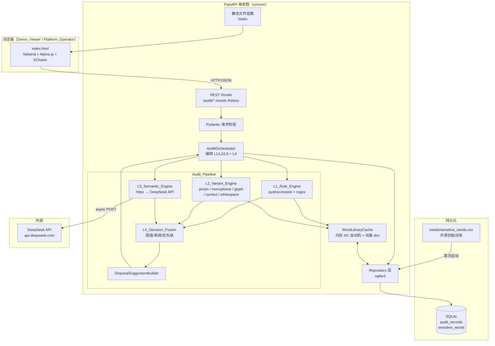
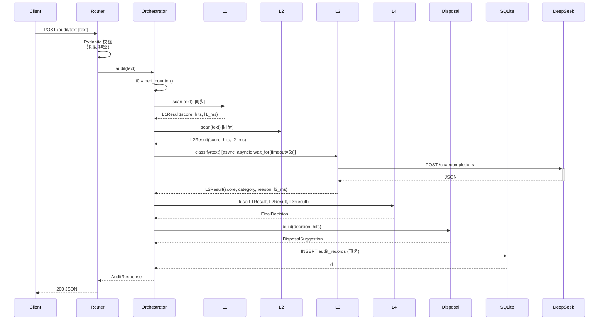
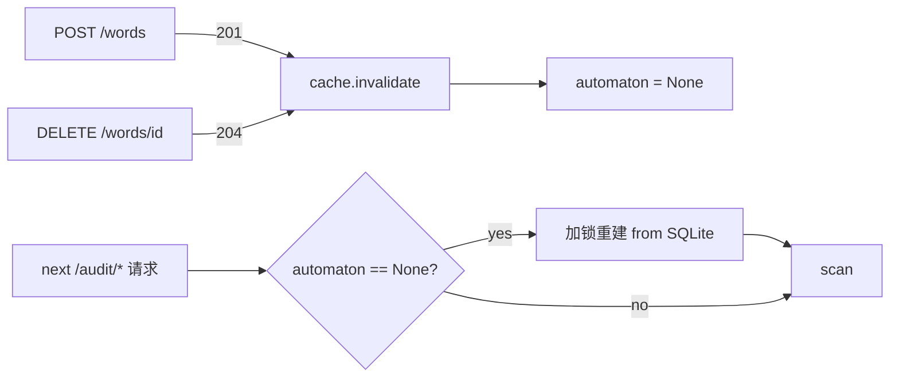

# 设计文档：内容安全审核平台（Content Audit Platform）

## Overview

内容安全审核平台是一个面向中文文本的轻量级审核原型，模拟阿里云内容安全 / 网易易盾的核心能力。系统由 **REST API + 静态 Web 控制台** 构成，核心是一条 **四层串行+并行混合的审核流水线**：

- **L1 规则层**：基于 Aho-Corasick 的多模式敏感词匹配 + 正则规则匹配。
- **L2 变体层**：拼音 / 谐音 / 形近 / 符号 / 空白 5 类规避手段识别。
- **L3 语义层**：调用 DeepSeek LLM API 做语义级判定。
- **L4 融合层**：综合三层 score 与命中类别，输出最终 `risk_level` / `category` / `confidence_score` / `disposal_suggestion`。

### 设计目标

1. **可在 30~40 小时内由单人开发完成**：选用成熟 Python 生态（FastAPI、SQLite、pyahocorasick、pypinyin、httpx），不引入消息队列、缓存中间件或微服务。
2. **演示友好**：前端为单文件静态 HTML（Tailwind + Alpine.js + ECharts，全部 CDN），无构建链；后端单进程 FastAPI。
3. **可直接对接需求**：4 档风险 × 6 类违规标签 × 5 种处置动作的映射在服务端完整闭环，调用方无需二次决策。

### 关键技术决策与依据

| 决策点 | 选型 | 理由 |
|---|---|---|
| Web 框架 | FastAPI 0.110+ | 原生支持 async（L3 调用是 IO 密集），自动生成 OpenAPI，与 Pydantic v2 紧密集成做请求校验。 |
| 持久化 | SQLite (stdlib `sqlite3`) | 单文件零运维，满足 R16；50 条/批 + 90 天历史的负载下完全够用。 |
| 多模式匹配 | `pyahocorasick` 2.x | C 扩展实现，10 万词库扫描 2000 字符 < 10 ms，满足 R1.4。 |
| 拼音 | `pypinyin` 0.50+ | 维护活跃、支持多音字策略；满足 R2.2。 |
| LLM 客户端 | `httpx` 0.27+（async） | 与 FastAPI async 一致，原生超时控制满足 R3.4 / R17.2。 |
| 前端栈 | 静态 HTML + Tailwind CDN + Alpine.js + ECharts | 无构建步骤，单文件 `index.html` 即可运行；雷达图（R12.6）使用 ECharts。 |
| 配置管理 | `pydantic-settings` 读取 `.env` | DeepSeek API key、超时、词库路径等集中配置，便于演示环境切换。 |

### 范围与非目标

**范围内**：四层审核流水线、4 档分级、6 类标签、5 种处置动作、词库 CRUD、历史查询、4 个 Tab 的 Web 控制台。

**显式排除（不在本设计中）**：鉴权、多租户、计费、限流、图像/视频审核、异步批处理任务、人审工作流、统计仪表盘、主动学习闭环。

---

## Architecture

### 系统架构图



### 组件职责与边界

| 组件 | 职责 | 边界（不做什么） |
|---|---|---|
| **Web Console** | 渲染 4 个 Tab、调用 REST API、展示徽章/雷达/高亮 | 不做任何审核计算；不缓存词库；不做鉴权 |
| **REST Router** | HTTP 入口、路由分发、状态码映射 | 不做业务逻辑；不直连 SQLite |
| **Validator** | 请求体格式 / 长度 / 枚举校验 | 不做业务规则校验（如时间区间） |
| **AuditOrchestrator** | 编排三层（L1 同步 → L2 同步 → L3 异步），收集结果交给 L4 | 不做评分；不直接写库（委托 Repository） |
| **L1/L2/L3 Engines** | 各自独立的纯函数式审核器（除 L3 异步 IO） | 不互相调用；不读写 SQLite |
| **L4_Decision_Fusion** | 纯函数：三层结果 → 最终结论 + Confidence_Score | 不调用任何 IO；不知道 DeepSeek 存在 |
| **DisposalSuggestionBuilder** | 纯函数：(risk_level, category, hits) → Disposal_Suggestion | 不查库 |
| **WordLibraryCache** | 进程内单例，持有 AC 自动机 + 词条元数据 dict；CRUD 触发重建 | 不做匹配（由 L1/L2 调用） |
| **Repository** | SQLite CRUD、事务、索引 | 不做业务校验 |

### 数据流：`/audit/text`



**编排策略说明**：
- L1 / L2 是 CPU 密集且通常 < 600 ms，串行同步执行（实现简单，避免线程池开销）。
- L3 是 IO 密集且可能 5 秒超时，使用 `await asyncio.wait_for(...)`；单条审核请求最多调用 1 次 DeepSeek（R3.1）。
- L4 / Disposal 是纯计算，串行无 IO。
- DB 写入在 L4 完成后，写库失败按 R8.8 返回 500 且响应体不含审核结果（事务回滚）。

### 数据流：`/audit/batch`

- Pydantic 在路由层校验：数组长度 ∈ [1, 50]、每条 ≤ 2000 字符、全部为字符串（R9.2 / R9.3 / R9.4 / R9.5）。
- 校验通过后，Orchestrator 对每条文本顺序调用 `audit(text)`（不并发，简化错误处理与速率控制；50 条 × 5 s 上限 = 250 s 远小于 R9.9 的 30 s——实际平均 < 1 s/条）。
- **批量写入采用单事务**：50 条结果在内存中聚合后，一次 `BEGIN ... COMMIT` 写入 `audit_records`；任一条 INSERT 抛错则 ROLLBACK，按 R9.8 返回 500。
- 响应 `results` 数组顺序与请求 `texts` 一一对应（R9.7）。

> **取舍说明**：批量请求理论上可并发跑 L3 以缩短延时，但需要并发限流以保护 DeepSeek 配额；30 s 的上限给了顺序执行充分余量，原型阶段优先选择实现简单。

---

## Components and Interfaces

下面给出关键类型的 Python 签名（伪代码风格，去除 import）。所有数据结构使用 Pydantic v2 `BaseModel`，便于自动 JSON 序列化和校验。

### 共用类型

```python
class RiskLevel(str, Enum):
    COMPLIANT = "合规"
    HINT      = "提示"
    WARNING   = "警告"
    VIOLATION = "违规"

class ViolationCategory(str, Enum):
    POLITICS     = "涉政"
    TERROR       = "暴恐"
    PORN         = "色情"
    ABUSE        = "辱骂"
    ILLEGAL_AD   = "违法广告"
    OTHER        = "其他"

class HitDetail(BaseModel):
    layer: Literal["L1", "L2", "L3"]
    engine: str           # "ahocorasick" | "regex" | "pinyin" | "homophone" | "glyph" | "symbol" | "whitespace" | "llm"
    matched_word: str     # 命中词（变体已还原）
    original_fragment: str  # 原文片段
    start: int            # 0 起整数偏移
    end: int              # 区间右开
    category: ViolationCategory
    level: RiskLevel
    flags: list[str] = []  # ["truncated", "l3_error"] 等

class LayerResult(BaseModel):
    score: float          # [0.0, 1.0]
    hits: list[HitDetail]
    elapsed_ms: int       # 非负整数

class L3Result(LayerResult):
    risk_level: RiskLevel | None
    category: ViolationCategory | None
    explanation: str      # ≤ 1000 字符（超长截断 + "...")
    error: str | None = None  # R3.5 错误时填错误描述

class DisposalSuggestion(BaseModel):
    platform_action: Literal["pass", "fold", "delete", "block", "manual_review"]
    user_message: str     # 1–100 码点
    operation_note: str   # 1–500 码点
```

### L1_Rule_Engine

**库选型**：`pyahocorasick` —— 提供原生 C 实现的 Aho-Corasick 自动机，构建一次后扫描 O(n + m + k)（n=文本长，m=词总长，k=命中数）。

**实现要点**：

1. `WordLibraryCache.get_automaton() → ahocorasick.Automaton`：进程内单例。第一次调用时从 SQLite `sensitive_words` 表加载所有词条，构建 AC 自动机；每条 `automaton.add_word(word, (word, category, level))` 携带元数据，扫描时 O(1) 取出。
2. **正则规则集**：从 `regex_rules.yaml` 加载，单条形如 `{name: phone, pattern: "1[3-9]\\d{9}", category: 违法广告, level: 警告}`。引擎启动时一次性 `re.compile`，扫描时遍历每条 pattern 调 `finditer`。规则数量上限 500 条（R1.3），原型阶段建议先放 5–10 条（手机号 / URL / QQ / 微信 / 邮箱）。
3. **L1 评分算法**（满足 R1.5 的等级单调 + 区间约束）：

```python
LEVEL_BASE = {RiskLevel.HINT: 0.20, RiskLevel.WARNING: 0.50, RiskLevel.VIOLATION: 0.85}
LEVEL_CAP  = {RiskLevel.HINT: 0.50, RiskLevel.WARNING: 0.85, RiskLevel.VIOLATION: 1.00}

def compute_layer_score(hits: list[HitDetail]) -> float:
    if not hits:
        return 0.0
    top_level = max(h.level for h in hits)  # 按 RiskLevel 顺序
    base = LEVEL_BASE[top_level]
    cap  = LEVEL_CAP[top_level]
    # 同等级命中数越多分数越高，但绝不跨档；count=1 时取 base
    count_bonus = min(0.05 * (len(hits) - 1), cap - base - 0.01)
    return round(base + max(0.0, count_bonus), 4)
```

该公式保证 R1.5：等级 ≥ `违规` ⇒ score ≥ 0.85；`警告` ⇒ ∈ [0.50, 0.85)；`提示` ⇒ ∈ [0.20, 0.50)；命中数增加单调非递减。

4. **接口**：

```python
class L1RuleEngine:
    def __init__(self, cache: WordLibraryCache, regex_rules: list[CompiledRegexRule]): ...

    def scan(self, text: str) -> LayerResult:
        # R1.6: 空/None → score=0.0, hits=[]
        # R1.7: len(text) > 10000 → 抛 InputTooLongError（由 Router 转 400）
        ...
```

### L2_Variant_Engine

**子组件**（按调用顺序，五者独立、彼此并联，结果合并）：

| 子组件 | 库 | 算法概述 |
|---|---|---|
| `WhitespaceStripper` | stdlib `unicodedata` | 删除所有 Unicode 空白后用 AC 自动机扫描；命中位置回映射到原文 |
| `SymbolStripper` | 正则 `[^\u4e00-\u9fff\w]` | 删除非汉字非字母数字字符后扫描；位置回映射 |
| `PinyinMatcher` | `pypinyin` | 文本和每个敏感词都转拼音（`Style.NORMAL` 全拼，按 `space=""` 拼接），在拼音串上做 AC 匹配；多音字按 `pypinyin.lazy_pinyin(word, strict=True, heteronym=False)` 取主读音 |
| `HomophoneMatcher` | 内置 `homophones.json` | 逐字符替换为标准字（如 `氵→水`、`艹→艸`），再扫描 |
| `GlyphMatcher` | 内置 `glyph_confusables.json` | 逐字符替换形近字（如 `曰→日`、`o→0`），再扫描 |

**位置回映射**：每个 Stripper / Matcher 维护一个 `index_map: list[int]`，第 i 个保留字符在原文中的偏移；扫描后用 `index_map[start]` 与 `index_map[end-1] + 1` 还原原始 start/end。

**L2 评分**（R2.8 直接编码）：

```python
def compute_l2_score(hits: list[HitDetail]) -> float:
    if not hits:
        return 0.0
    engines = {h.engine for h in hits}
    if engines & {"pinyin", "homophone", "glyph"}:
        return 0.90
    return 0.60  # 仅 symbol / whitespace
```

**截断与短路**（R2.10 / R2.11）：
- 输入为空或全空白 → 直接返回 `LayerResult(score=0.0, hits=[])`。
- 输入 > 2000 字符 → 截至前 2000 字符，所有 hit 加 `flags=["truncated"]`。

**接口**：
```python
class L2VariantEngine:
    def scan(self, text: str) -> LayerResult: ...
```

### L3_Semantic_Engine

**Prompt 模板**（system + user 两段，固定中文）：

```
[system]
你是中文内容安全审核员。请严格按照下面 JSON Schema 输出，不要输出任何额外文字。

Schema:
{
  "risk_level": "合规" | "提示" | "警告" | "违规",
  "category":   "涉政" | "暴恐" | "色情" | "辱骂" | "违法广告" | "其他" | "合规",
  "reason":     "<= 200 字的中文说明",
  "score":      0.0 到 1.0 之间的浮点数
}

判定标准：
- 合规：内容无任何风险，可放行；score ≤ 0.20。
- 提示：存在轻微不当但可放行；0.20 < score < 0.50。
- 警告：存在明显风险需复核；0.50 ≤ score < 0.85。
- 违规：严重违规需拦截；score ≥ 0.85。

[user]
请审核以下文本：
"""
{text}
"""
```

**HTTP 调用**：
```python
class L3SemanticEngine:
    async def classify(self, text: str) -> L3Result:
        try:
            async with httpx.AsyncClient(timeout=httpx.Timeout(connect=2, read=5, write=2, pool=2)) as cli:
                resp = await cli.post(
                    f"{self.base_url}/chat/completions",
                    headers={"Authorization": f"Bearer {self.api_key}"},
                    json={
                        "model": "deepseek-chat",
                        "messages": [...],
                        "response_format": {"type": "json_object"},
                        "temperature": 0.0,
                    },
                )
            resp.raise_for_status()
            payload = resp.json()
            content = payload["choices"][0]["message"]["content"]
            data = json.loads(content)
            self._validate_schema(data)  # R3.2 / R3.6
            return self._build_result(data)
        except (httpx.TimeoutException, httpx.HTTPError, json.JSONDecodeError, SchemaError) as e:
            return L3Result(
                score=0.0, hits=[],
                risk_level=None, category=None,
                explanation=f"L3 错误：{type(e).__name__} - {str(e)[:200]}",
                error=str(e),
                elapsed_ms=...,
            )  # R3.5
```

**关键参数**：
- `temperature=0.0`：尽量稳定输出。
- `response_format={"type": "json_object"}`：DeepSeek 兼容 OpenAI 的 JSON 模式。
- `read` 超时 5 s，总超时 ≤ 10 s（R3.4）。
- 返回 `reason` 长度 > 1000 字符则截断至 1000 + `"..."`（R3.3）。

**Hit_Detail 生成**：当 L3 给出 `risk_level != 合规` 时，构造一条 `HitDetail(layer="L3", engine="llm", matched_word="<整段文本前 50 字>", start=0, end=len(text), category=..., level=..., flags=[])`；L3 出错时，构造 `HitDetail(layer="L3", engine="llm", flags=["l3_error"], ...)`。

### L4_Decision_Fusion

**纯函数实现**（无 IO，便于属性测试）：

```python
def fuse(l1: LayerResult, l2: LayerResult, l3: L3Result) -> FinalDecision:
    layer_scores = [l1.score, l2.score, l3.score]
    max_score = max(layer_scores)

    # R4.2: 阈值映射
    if max_score >= 0.85:
        risk = RiskLevel.VIOLATION
    elif max_score >= 0.50:
        risk = RiskLevel.WARNING
    elif max_score >= 0.20:
        risk = RiskLevel.HINT
    else:
        risk = RiskLevel.COMPLIANT

    # R4.4: 类别选择 —— score 最高的层；并列时 L3 > L2 > L1
    layers = [("L3", l3.score, _l3_category(l3)),
              ("L2", l2.score, _hit_category(l2.hits)),
              ("L1", l1.score, _hit_category(l1.hits))]  # 顺序即并列优先级
    winning = max(layers, key=lambda x: x[1])  # max 稳定，先到先得
    final_category = winning[2] if risk != RiskLevel.COMPLIANT else ""

    # R4.5: confidence ≥ max_score
    confidence = max_score
    if risk == RiskLevel.COMPLIANT:
        confidence = max(0.8, 1.0 - max_score)  # R4.6: ≥ 0.8

    # R4.8: 任一层 unavailable → 限制 confidence ≤ 0.7
    if any(getattr(r, "error", None) or r.elapsed_ms < 0 for r in [l1, l2, l3]):
        confidence = min(confidence, 0.7)

    return FinalDecision(risk_level=risk, category=final_category,
                         confidence_score=round(confidence, 4))
```

**关于 R4.3 单调性**：上述实现中，最终 risk 仅依赖 `max(layer_scores)`，且阈值映射函数 `score → risk` 单调非递减；类别选择不影响 risk。⇒ 任一层 score 严格增大不会使 risk 降低。证明详见后文 Correctness Properties。

### DisposalSuggestionBuilder

**(Risk_Level, Violation_Category) → Platform_Action 映射表**（满足 R7.3 / R7.4 / R7.5）：

| Risk_Level | Violation_Category | Platform_Action |
|---|---|---|
| 合规 | (any) | `pass` |
| 提示 | (any) | `pass` |
| 警告 | 涉政 / 暴恐 / 色情 | `manual_review` |
| 警告 | 辱骂 / 违法广告 / 其他 | `fold` |
| 违规 | 涉政 / 暴恐 / 色情 | `block` |
| 违规 | 辱骂 / 违法广告 / 其他 | `delete` |

**user_message 模板**（≤ 100 码点，不含敏感词，R7.6）：

```python
USER_MESSAGE = {
    RiskLevel.COMPLIANT: "内容已通过审核。",
    RiskLevel.HINT:      "内容已发布，请遵守社区规范。",
    RiskLevel.WARNING:   "内容存在风险，已提交人工复核或部分折叠。",
    RiskLevel.VIOLATION: "内容因违反社区规范已被处置，请修改后重试。",
}
```

**operation_note 生成**（包含 category + risk_level + 关键命中词，R7.7，≤ 500 码点）：

```python
def build_note(decision, hits) -> str:
    top_hits = sorted(hits, key=lambda h: h.level, reverse=True)[:3]
    keywords = " / ".join(h.matched_word for h in top_hits) or "无显性命中"
    note = f"[{decision.risk_level.value}][{decision.category or '合规'}] 触发命中：{keywords}"
    if len(note) > 500:
        note = note[:497] + "..."
    return note
```

**回退路径**（R7.8）：任一字段构造时抛异常 → 返回 `DisposalSuggestion(platform_action="manual_review", user_message="审核结果生成失败，请人工复核。", operation_note=f"系统错误回退：{exc!r}")`。

### WordLibraryCache

```python
class WordLibraryCache:
    def __init__(self, repo: WordRepository):
        self._lock = threading.RLock()
        self._automaton: ahocorasick.Automaton | None = None
        self._words_by_id: dict[int, WordEntry] = {}

    def get_automaton(self) -> ahocorasick.Automaton:
        with self._lock:
            if self._automaton is None:
                self._rebuild()
            return self._automaton

    def invalidate(self) -> None:
        with self._lock:
            self._automaton = None  # 下次 get 时懒重建（R10.7：1 秒内生效）
```

每次 `/words` POST/DELETE 成功后调用 `cache.invalidate()`；下一次审核请求触发 `_rebuild()`（10 万词 + Trie 构建实测 < 200 ms，远低于 1 秒预算）。

### REST API 模块

每个端点独立的 Pydantic 请求/响应模型，FastAPI 自动校验：

```python
class AuditTextRequest(BaseModel):
    text: str = Field(min_length=1, max_length=2000)

class AuditTextResponse(BaseModel):
    risk_level: RiskLevel
    violation_category: str  # 6 类枚举值或 ""
    confidence_score: float
    l1_score: float
    l2_score: float
    l3_score: float
    hit_details: list[HitDetail]
    llm_explanation: str
    disposal_suggestion: DisposalSuggestion
    processing_time: ProcessingTime  # {l1_ms, l2_ms, l3_ms, total_ms}

class AuditBatchRequest(BaseModel):
    texts: list[str] = Field(min_length=1, max_length=50)
    @field_validator("texts")
    @classmethod
    def each_text_valid(cls, v):
        for i, t in enumerate(v):
            if not isinstance(t, str):
                raise ValueError(f"texts[{i}] must be str")
            if len(t) > 2000:
                raise ValueError(f"texts[{i}] exceeds 2000 chars")
        return v

class WordCreateRequest(BaseModel):
    word: str = Field(min_length=1, max_length=64)
    category: ViolationCategory
    level: RiskLevel
    @field_validator("word")
    @classmethod
    def not_only_whitespace(cls, v):
        if not v.strip():
            raise ValueError("word must not be only whitespace")
        return v.strip()
```

**HTTP 状态码映射**：

| 场景 | 状态码 |
|---|---|
| 单条/批量审核成功 | 200 |
| 新增词条成功 | 201 |
| 删除词条成功 | 204 |
| 请求字段非法（长度、类型、枚举、时间区间） | 400 |
| 删除不存在的词条 | 404 |
| L1/L2 不可恢复异常、SQLite 写入失败 | 500 |

**统一错误响应包络**：

```json
{
  "error": {
    "code": "INPUT_TOO_LONG",
    "message": "text 字段长度 2150 超过 2000 字符上限",
    "details": { "field": "text", "max": 2000, "actual": 2150 }
  }
}
```

错误码枚举（受控字符串）：`INPUT_TOO_LONG`, `INPUT_EMPTY`, `INVALID_JSON`, `FIELD_MISSING`, `FIELD_TYPE_INVALID`, `BATCH_SIZE_OUT_OF_RANGE`, `BATCH_ITEM_TOO_LONG`, `INVALID_ENUM`, `INVALID_TIME_RANGE`, `WORD_NOT_FOUND`, `INTERNAL_ERROR`, `PERSISTENCE_FAILED`, `L3_TIMEOUT`（仅在 hit_details flags 中出现，不直接作为顶层错误）。

### Web Console（前端）

单文件 `static/index.html`，结构：

```html
<!doctype html>
<html lang="zh-CN">
<head>
  <meta charset="utf-8" />
  <script src="https://cdn.tailwindcss.com"></script>
  <script defer src="https://cdn.jsdelivr.net/npm/alpinejs@3/dist/cdn.min.js"></script>
  <script src="https://cdn.jsdelivr.net/npm/echarts@5/dist/echarts.min.js"></script>
</head>
<body x-data="app()">
  <nav>4 个 Tab 切换按钮 → 控制 currentTab</nav>
  <section x-show="currentTab==='single'"><!-- 单条审核 --></section>
  <section x-show="currentTab==='batch'" ><!-- 批量审核 --></section>
  <section x-show="currentTab==='history'"><!-- 历史记录 --></section>
  <section x-show="currentTab==='words'"  ><!-- 敏感词管理 --></section>
  <script>function app() { return { currentTab:'single', ...单条状态, ...批量状态, ... } }</script>
</body>
</html>
```

**组件级别拆分（Alpine 子作用域）**：

| Tab | 关键组件 | 状态字段 |
|---|---|---|
| 单条审核 | TextInput（带字符计数）、SubmitButton、ResultPanel（badges + tags + highlight + RadarChart + LLM/Disposal 分区） | `singleText`, `singleLoading`, `singleResult`, `singleError` |
| 批量审核 | TextArea（多行）、FileInput（.txt）、BatchTable、DetailModal（复用 ResultPanel） | `batchTexts`, `batchLoading`, `batchResults`, `selectedRow` |
| 历史记录 | FilterBar（4 档/6 类下拉 + 日期选择器 + 翻页）、HistoryList、DetailModal | `historyFilter`, `historyItems`, `historyTotal`, `historyPage` |
| 敏感词管理 | FilterBar、WordTable（含删除按钮 + 二次确认 modal）、WordCreateForm | `wordFilter`, `wordItems`, `wordForm`, `confirmDeleteId` |

**HTTP 客户端**（统一封装 `apiCall`）：

```javascript
async function apiCall(method, path, body, timeoutMs) {
  const ctrl = new AbortController();
  const timer = setTimeout(() => ctrl.abort(), timeoutMs);
  try {
    const resp = await fetch(path, {
      method, signal: ctrl.signal,
      headers: { 'Content-Type': 'application/json' },
      body: body ? JSON.stringify(body) : undefined,
    });
    if (!resp.ok) {
      const err = await resp.json().catch(() => ({ error: { message: resp.statusText } }));
      throw new ApiError(resp.status, err.error?.code, err.error?.message);
    }
    return resp.status === 204 ? null : await resp.json();
  } catch (e) {
    if (e.name === 'AbortError') throw new ApiError(0, 'TIMEOUT', '请求超时');
    throw e;
  } finally { clearTimeout(timer); }
}
```

**超时设置**：单条 10 s（R12.8）、批量 30 s（R13.6）、历史 5 s（R14.6）、词条增删 5 s（R15.6 / R15.8）。

**雷达图渲染**（R12.6）：每次结果更新后用 `echarts.init(el).setOption({radar: {indicator: [{name:'L1',max:1},{name:'L2',max:1},{name:'L3',max:1}]}, series: [{type:'radar', data:[{value:[l1,l2,l3]}]}]})`。

**命中高亮**（R12.5）：将 `hit_details` 按 `start` 排序，顺序拼接 `<span class="bg-yellow-200" title="L1: 敏感词">命中片段</span>`，未命中段直接拼接文本。Hit 重叠时按 `start` 升序、`end` 降序合并展示。

---

## Data Models

### SQLite 表结构

```sql
-- 审核记录表
CREATE TABLE IF NOT EXISTS audit_records (
    id                       INTEGER PRIMARY KEY AUTOINCREMENT,
    text                     TEXT    NOT NULL,
    risk_level               TEXT    NOT NULL CHECK (risk_level IN ('合规','提示','警告','违规')),
    violation_category       TEXT    NOT NULL DEFAULT '' CHECK (
                                violation_category IN ('','涉政','暴恐','色情','辱骂','违法广告','其他')),
    confidence_score         REAL    NOT NULL CHECK (confidence_score BETWEEN 0.0 AND 1.0),
    l1_score                 REAL    NOT NULL CHECK (l1_score BETWEEN 0.0 AND 1.0),
    l2_score                 REAL    NOT NULL CHECK (l2_score BETWEEN 0.0 AND 1.0),
    l3_score                 REAL    NOT NULL CHECK (l3_score BETWEEN 0.0 AND 1.0),
    hit_details_json         TEXT    NOT NULL,  -- JSON array
    llm_explanation          TEXT    NOT NULL DEFAULT '',
    disposal_suggestion_json TEXT    NOT NULL,  -- JSON object
    processing_time_json     TEXT    NOT NULL,  -- JSON object
    created_at               TEXT    NOT NULL   -- ISO 8601 UTC, e.g. '2025-01-15T08:30:00.123Z'
);

CREATE INDEX IF NOT EXISTS idx_audit_created_at        ON audit_records(created_at DESC);
CREATE INDEX IF NOT EXISTS idx_audit_risk_level        ON audit_records(risk_level);
CREATE INDEX IF NOT EXISTS idx_audit_violation_category ON audit_records(violation_category);
CREATE INDEX IF NOT EXISTS idx_audit_compound          ON audit_records(risk_level, violation_category, created_at DESC);

-- 敏感词库表
CREATE TABLE IF NOT EXISTS sensitive_words (
    id         INTEGER PRIMARY KEY AUTOINCREMENT,
    word       TEXT    NOT NULL CHECK (length(word) BETWEEN 1 AND 64),
    category   TEXT    NOT NULL CHECK (category IN ('涉政','暴恐','色情','辱骂','违法广告','其他')),
    level      TEXT    NOT NULL CHECK (level IN ('合规','提示','警告','违规')),
    source     TEXT    NOT NULL CHECK (source IN ('builtin','custom')),
    created_at TEXT    NOT NULL
);

CREATE UNIQUE INDEX IF NOT EXISTS uk_word_source ON sensitive_words(word, source);
CREATE INDEX        IF NOT EXISTS idx_word_category ON sensitive_words(category);
CREATE INDEX        IF NOT EXISTS idx_word_level    ON sensitive_words(level);
```

### JSON 子结构 schema

`hit_details_json` —— `HitDetail[]`：
```json
[
  {
    "layer": "L1",
    "engine": "ahocorasick",
    "matched_word": "示例敏感词",
    "original_fragment": "示例敏感词",
    "start": 5,
    "end": 10,
    "category": "辱骂",
    "level": "警告",
    "flags": []
  },
  {
    "layer": "L2",
    "engine": "pinyin",
    "matched_word": "示例敏感词",
    "original_fragment": "shilimingaiganci",
    "start": 12,
    "end": 28,
    "category": "辱骂",
    "level": "警告",
    "flags": []
  }
]
```

`disposal_suggestion_json` —— 单个对象：
```json
{
  "platform_action": "fold",
  "user_message": "内容存在风险，已提交人工复核或部分折叠。",
  "operation_note": "[警告][辱骂] 触发命中：示例敏感词 / 另一个词"
}
```

`processing_time_json` —— 单个对象：
```json
{ "l1_ms": 12, "l2_ms": 87, "l3_ms": 1832, "total_ms": 1945 }
```

### 完整示例：Happy Path 响应（`/audit/text`）

请求：
```json
{ "text": "前面是一段正常文本，但夹杂了傻 逼这个词。" }
```

200 响应：
```json
{
  "risk_level": "警告",
  "violation_category": "辱骂",
  "confidence_score": 0.6,
  "l1_score": 0.0,
  "l2_score": 0.6,
  "l3_score": 0.55,
  "hit_details": [
    {
      "layer": "L2",
      "engine": "whitespace",
      "matched_word": "傻逼",
      "original_fragment": "傻 逼",
      "start": 11,
      "end": 14,
      "category": "辱骂",
      "level": "警告",
      "flags": []
    },
    {
      "layer": "L3",
      "engine": "llm",
      "matched_word": "前面是一段正常文本，但夹杂了傻 逼这个词。",
      "original_fragment": "前面是一段正常文本，但夹杂了傻 逼这个词。",
      "start": 0,
      "end": 21,
      "category": "辱骂",
      "level": "警告",
      "flags": []
    }
  ],
  "llm_explanation": "文本包含明显的人身攻击辱骂用词，建议折叠或人工复核。",
  "disposal_suggestion": {
    "platform_action": "fold",
    "user_message": "内容存在风险，已提交人工复核或部分折叠。",
    "operation_note": "[警告][辱骂] 触发命中：傻逼"
  },
  "processing_time": { "l1_ms": 8, "l2_ms": 142, "l3_ms": 1523, "total_ms": 1681 }
}
```

### 完整示例：错误响应（`/audit/text`，文本超长）

请求：
```json
{ "text": "<2150 字符的中文文本>" }
```

400 响应：
```json
{
  "error": {
    "code": "INPUT_TOO_LONG",
    "message": "text 字段长度 2150 超过 2000 字符上限",
    "details": { "field": "text", "max": 2000, "actual": 2150 }
  }
}
```

---

## Correctness Properties

*A property is a characteristic or behavior that should hold true across all valid executions of a system—essentially, a formal statement about what the system should do. Properties serve as the bridge between human-readable specifications and machine-verifiable correctness guarantees.*

本平台中绝大多数核心逻辑（评分函数、L4 融合、处置映射、请求校验、词库 CRUD 往返）都是纯函数或具有清晰输入输出的服务，非常适合属性测试。下列属性已经过冗余消除（重叠属性合并为单条普适断言），共 18 条核心属性 + 1 条标识为 EXAMPLE 的兜底场景。

### Property 1: L1 命中元数据完整

*For any* 合法 `sensitive_words` 词库 W 与任意包含 W 中至少一个明文敏感词的 1–2000 字符文本 T，`L1RuleEngine.scan(T)` 返回的每条 `HitDetail` 都满足：`layer == "L1"`、`engine ∈ {"ahocorasick","regex"}`、`0 ≤ start < end ≤ len(T)`、`T[start:end] == matched_word`、`(category, level)` 等于该词在 W 中标注的元数据。

**Validates: Requirements 1.2, 6.3**

### Property 2: L1 评分按等级落入指定区间且对命中数单调非递减

*For any* 命中列表 H（每条带合法的 `level ∈ {提示,警告,违规}`），`compute_layer_score(H)` 满足：
- 当 H 中存在至少一条 `level == 违规` ⇒ score ≥ 0.85；
- 当 H 中最高等级为 `警告` ⇒ 0.50 ≤ score < 0.85；
- 当 H 中最高等级为 `提示` ⇒ 0.20 ≤ score < 0.50；
- 在最高等级不变时，向 H 追加任意一条同最高等级的命中 ⇒ 新 score ≥ 旧 score。

**Validates: Requirements 1.5**

### Property 3: L1 输入超长拒绝

*For any* 长度严格大于 10000 个 Unicode 码点的字符串 T，`L1RuleEngine.scan(T)` 抛出 `InputTooLongError`，且函数不返回任何 `LayerResult`。

**Validates: Requirements 1.7**

### Property 4: L2 五种变体识别完备

*For any* 词库 W 与任意 W 中合法长度（2 ≤ len ≤ 10）的敏感词 w，对 w 应用以下五种变体之一构造文本 T，`L2VariantEngine.scan(T)` 返回的 hits 中至少存在一条满足 `matched_word == w`、`engine == 对应技术名` 且 `0 ≤ start < end ≤ len(T)`：
1. 拼音化：将 w 至少 50% 字符替换为 `pypinyin` 的全拼（engine=`pinyin`）；
2. 谐音替换：根据内置 `homophones.json` 将 w 字符替换（engine=`homophone`）；
3. 形近替换：根据内置 `glyph_confusables.json` 将 w 字符替换（engine=`glyph`）；
4. 符号插入：在 w 字符之间插入任意非汉字非字母数字字符（engine=`symbol`）；
5. 空白插入：在 w 字符之间插入任意 Unicode 空白字符（engine=`whitespace`）。

**Validates: Requirements 2.2, 2.3, 2.4, 2.5, 2.6, 2.7**

### Property 5: L2 评分公式

*For any* 命中列表 H，`compute_l2_score(H)` 满足：H 为空 ⇒ 0.0；H 中至少一条 engine ∈ {pinyin,homophone,glyph} ⇒ 0.90；否则（仅含 symbol/whitespace） ⇒ 0.60。

**Validates: Requirements 2.8**

### Property 6: L2 长文本截断标志

*For any* 长度严格大于 2000 字符的文本 T，`L2VariantEngine.scan(T)` 返回的每条 hit 都满足 `"truncated" ∈ flags` 且 `start < 2000`。

**Validates: Requirements 2.10**

### Property 7: L3 错误回退

*For any* 模拟的 DeepSeek 客户端错误 e ∈ {超时、5xx HTTP 错误、非合法 JSON、缺失必需字段、`risk_level` 或 `category` 不在合法枚举内}，`L3SemanticEngine.classify(任意非空文本)` 返回的 `L3Result` 满足：`score == 0.0` ∧ `error 字符串非空` ∧ `LLM_Explanation` 包含错误类型描述 ∧ 后续 fuse 的 hits 中存在一条 `flags` 含 `"l3_error"`。

**Validates: Requirements 3.5, 3.6, 6.6**

### Property 8: L3 解释长度截断

*For any* 模拟 DeepSeek 返回的 reason 字符串 r，`L3SemanticEngine.classify(...)` 输出的 `LLM_Explanation` 满足：`len(out) ≤ 1003`，且 `len(r) > 1000 ⇔ out.endswith("...")`。

**Validates: Requirements 3.3**

### Property 9: L4 阈值映射 + 风险单调性

*For any* 三元组 `(l1, l2, l3) ∈ [0,1]^3` 配以任意类别标签：

- 阈值映射：`fuse(...).risk_level` 对应 `max(l1,l2,l3)` 落入的区间（< 0.2 → 合规；[0.2, 0.5) → 提示；[0.5, 0.85) → 警告；≥ 0.85 → 违规）。
- 单调性：对任意另一三元组 `(l1', l2', l3')` 满足 `l1' ≥ l1 ∧ l2' ≥ l2 ∧ l3' ≥ l3`，`fuse(l1',l2',l3').risk_level` 在 `合规 < 提示 < 警告 < 违规` 的偏序下不低于 `fuse(l1,l2,l3).risk_level`。

**Validates: Requirements 4.2, 4.3, 5.3, 5.4, 5.5, 5.6, 5.7**

### Property 10: L4 类别选择优先级

*For any* 三元组 `((l1,c1), (l2,c2), (l3,c3))` 中各层的 (score, category)，当结果非合规时，`fuse(...).violation_category` 等于 score 最高层的 category；多层 score 相等时按 `L3 > L2 > L1` 优先级取胜出层的 category。

**Validates: Requirements 4.4, 6.4**

### Property 11: Confidence 与三层信息保留约束

*For any* 三个层结果 `(L1, L2, L3)`：
- `fuse(...).confidence_score ≥ max(l1.score, l2.score, l3.score)`；
- 当三层 score 全 < 0.2 ⇒ `confidence_score ∈ [0.8, 1.0]`；
- 当任一层标记 `error != None` ⇒ `confidence_score ≤ 0.7`；
- `fuse(...)` 的输出对象按字段值完整保留 L1/L2/L3 的 `score` 与 `hits`。

**Validates: Requirements 4.5, 4.6, 4.7, 4.8**

### Property 12: 审核响应 schema 与分级/类别不变量

*For any* 通过 `/audit/text` 或 `/audit/batch` 处理成功（200）的合法输入，响应 JSON 满足：
- 包含全部字段 `risk_level, violation_category, confidence_score, l1_score, l2_score, l3_score, hit_details, llm_explanation, disposal_suggestion, processing_time`；
- `risk_level ∈ {合规,提示,警告,违规}`；
- `risk_level == "合规" ⇔ violation_category == ""`；
- `risk_level != "合规" ⇒ violation_category ∈ {涉政,暴恐,色情,辱骂,违法广告,其他}`。

**Validates: Requirements 5.1, 6.1, 6.5, 8.4, 9.6, 11.4**

### Property 13: 处置建议结构与 (risk, category) → action 映射

*For any* `(risk_level, violation_category)` 二元组（含 `risk_level == 合规 ⇒ category == ""`），`DisposalSuggestionBuilder.build(...)` 返回的 `DisposalSuggestion` 满足：
- `platform_action ∈ {pass, fold, delete, block, manual_review}`；
- 三个字段 `strip()` 后长度 > 0；
- `1 ≤ codepoint_len(user_message) ≤ 100`；任何 `hit.matched_word` 都不出现在 `user_message` 中；
- `1 ≤ codepoint_len(operation_note) ≤ 500`；`operation_note` 包含 `risk_level` 文字 与 `violation_category`（合规时为 "合规"）；当 hits 非空时至少包含其中一条 `matched_word`；
- 严格遵循映射表：合规⇒pass；违规∧category∈{涉政,暴恐,色情}⇒block；违规∧其他类别⇒delete；警告⇒fold 或 manual_review；提示⇒pass 或 fold。

**Validates: Requirements 7.1, 7.2, 7.3, 7.4, 7.5, 7.6, 7.7**

### Property 14: 处理时间约束

*For any* 完成的审核响应，`processing_time` 满足：四字段都是非负整数且 ≤ 60000；`max(l1_ms, l2_ms, l3_ms) ≤ total_ms ≤ l1_ms + l2_ms + l3_ms + 100`。

**Validates: Requirements 17.1, 17.3**

### Property 15: 单条审核请求校验

*For any* HTTP 请求体满足以下任一条件之一：(a) 不是合法 JSON；(b) 缺失 `text` 字段；(c) `text` 非字符串；(d) `text` 为空字符串；(e) `text` 长度 > 2000 个 Unicode 码点 — `POST /audit/text` 返回 HTTP 400 状态码、响应符合统一错误包络结构、且 `audit_records` 表行数不变。

**Validates: Requirements 8.2, 8.3**

### Property 16: 批量审核请求校验与原子性

*For any* `/audit/batch` 请求 R：
- 校验：当 R 满足以下任一条件 — `texts` 不存在 / 非数组 / 包含非字符串元素 / 数组长度 ∉ [1,50] / 任一元素长度 > 2000 — POST 返回 400，`audit_records` 表行数不变；
- 顺序：当 R 合法时，`response.results[i]` 对应 `texts[i]`（按位置一一对应）；
- 原子性：当任一条 INSERT 失败时（注入故障），`audit_records` 表行数不变，POST 返回 500；
- 成功落库：当 R 合法且无故障时，`audit_records` 行数恰好增加 `len(texts)`，且每条新记录的 `text` 与 `texts[i]` 完全一致。

**Validates: Requirements 9.3, 9.4, 9.5, 9.7, 9.8**

### Property 17: 词库 CRUD 往返与生效

*For any* 合法 `(word, category, level)` 三元组：
- 入库往返：`POST /words` 返回 201 + 新 id；随后 `GET /words` 的 items 包含该词条；`DELETE /words/{id}` 返回 204；之后 `GET /words` 不再包含该词条；
- 校验：当三元组中 `word` 缺失/空/全空白/> 64 字符，或 `category` ∉ 6 类，或 `level` ∉ 4 档，POST 返回 400 且 `sensitive_words` 行数不变；
- 删除不存在：对任意不存在的 `id`，DELETE 返回 404 且 `sensitive_words` 行数不变；
- 词库变更对审核生效：先 POST 一个新词 w（builtin 词库不含）使其 `level == 违规`，再 POST `/audit/text {text=w}` 应得到 `risk_level == 违规`；接着 DELETE 该词条后再次 POST `/audit/text {text=w}` 应得到 `l1_score < 0.85`；从写入到生效的间隔 < 1 秒；
- `(word, source)` 唯一：重复 POST 相同词条触发底层 `IntegrityError`（API 层捕获并返回 400/409）。

**Validates: Requirements 10.2, 10.4, 10.5, 10.6, 10.7, 10.9, 10.10, 16.4**

### Property 18: 历史查询过滤、分页与重启持久化

*For any* 已写入 `audit_records` 的记录集合 S 与任意 `/history` 查询参数 Q：
- `start_time > end_time` ⇒ 返回 400；`start_time == end_time` ⇒ 返回 200；其他非法参数（枚举越界、page < 1、page_size > 100、时间格式非法）⇒ 返回 400；
- 合法 Q ⇒ 返回 200，所有 `items` 满足 Q 的过滤条件，`items` 按 `created_at` 倒序排列，`len(items) ≤ page_size`，`total` 等于 S 中匹配 Q 的总条数；
- 重启持久化：先 POST `/audit/text` 与 `/words` 各若干次成功（200 / 201）；将 SQLite 连接关闭后重新打开（模拟进程重启）；通过 `/history` 与 `/words` 读取的记录集合与重启前一致（条数 + 字段）。

**Validates: Requirements 8.6, 11.1, 11.4, 11.5, 11.6, 16.4, 16.7, 16.8**

> **关于以下场景，使用 EXAMPLE 而非 PROPERTY 测试**：
> - R5.8（评分缺失默认为警告）、R7.8（disposal builder 内部错误回退 manual_review）、R8.7（L1/L2 不可恢复异常 → 500）、R8.8（持久化失败 → 500 + 不返审核结果）、R16.6（内置词库文件不存在 → 启动失败）：这些是单一异常路径，注入即可，无需多次迭代。
> - 所有 `/audit/text` 处理成功后已落库（R8.6）已并入 Property 18 的"重启持久化"前置。
> - R16.5（首次启动 30 秒内导入 ≥ 1000 条 builtin）：一次性集成测试。

---

## Sensitive Word Library

### 引导来源（Bootstrap）

参考 GitHub 上的公开词库项目（不引入运行时依赖、仅离线下载 CSV/TXT）：

- [observerss/textfilter](https://github.com/observerss/textfilter) `sensitive_words.txt`：通用敏感词约 5000 条，无类别/等级。
- [TextFilter](https://github.com/houbb/sensitive-word) 的开源词典：分文件按类别组织（涉政、色情、暴恐等）。
- [fwwdn/sensitive-stop-words](https://github.com/fwwdn/sensitive-stop-words)：分类的 txt 文件（政治类、色情类、辱骂类、广告类）。

> 本项目自带的 seed 文件采用最后一个仓库（按目录名即类别）作为基础，因为它原生提供分类。

### 类别 / 等级映射策略

源词条的元数据完整度参差不齐。映射规则：

| 源信息 | 平台 category | 平台 level |
|---|---|---|
| 文件名/目录名包含"政治" | 涉政 | 违规 |
| 文件名/目录名包含"暴力""恐怖" | 暴恐 | 违规 |
| 文件名/目录名包含"色情""淫秽" | 色情 | 违规 |
| 文件名/目录名包含"骂""脏""人身攻击" | 辱骂 | 警告 |
| 文件名/目录名包含"广告""推广""引流" | 违法广告 | 警告 |
| 其他无法识别 | 其他 | 提示 |

**等级降级原则**：开源词库通常较激进，原型阶段按上表的 "保守等级" 处理；运营人员可通过 `/words` API 添加 `level == 违规` 的精确词条。

### Seed 文件格式

`seeds/sensitive_words.csv`（UTF-8，逗号分隔，首行 header）：

```csv
word,category,level
李某某,涉政,违规
炸药制作,暴恐,违规
傻逼,辱骂,警告
办证,违法广告,警告
赌博网站,违法广告,违规
法轮,涉政,违规
```

约束：每条 `len(word) ∈ [1, 64]`、`category ∈ 6 类`、`level ∈ 4 档`、不重复。CSV 解析后逐行 INSERT，`source='builtin'`，`created_at` 为启动时刻 ISO 8601 UTC。总条数 ≥ 1000（满足 R10.1）。

### 加载策略

**首次启动**（`COUNT(*) FROM sensitive_words == 0`）：

```python
def bootstrap_word_library(repo: WordRepository, seed_path: Path) -> int:
    if not seed_path.exists():
        raise StartupError(f"seed file missing: {seed_path}")  # R16.6: 终止启动
    rows = list(csv.DictReader(seed_path.open(encoding="utf-8")))
    if len(rows) < 1000:
        raise StartupError(f"seed has only {len(rows)} entries, need >= 1000")
    with repo.transaction():
        for row in rows:
            repo.insert_word(word=row["word"], category=row["category"],
                             level=row["level"], source="builtin")
    return len(rows)
```

**非首次启动**：跳过 seed 加载，直接读取 SQLite 现有数据。这意味着用户的自定义词条与之前导入的 builtin 词条都会保留，重复运行不会清表。

**热重载**（运行时词库变更）：见 *Non-Functional Considerations - 词库重载策略*。

---

## Project Layout

### 后端目录结构

```
content-audit-platform/
├── pyproject.toml                  # 依赖：fastapi, uvicorn, pyahocorasick, pypinyin, httpx, pydantic, pydantic-settings
├── .env.example                    # DEEPSEEK_API_KEY, DEEPSEEK_BASE_URL, SQLITE_PATH, SEED_PATH
├── README.md
├── seeds/
│   ├── sensitive_words.csv         # 至少 1000 条
│   ├── homophones.json             # 谐音字典 {char: [variants...]}
│   ├── glyph_confusables.json      # 形近字典
│   └── regex_rules.yaml            # 5–10 条结构化模式
├── data/                           # 运行时生成
│   └── audit.db                    # SQLite 文件
├── static/
│   └── index.html                  # 单文件前端
├── src/
│   └── audit/
│       ├── __init__.py
│       ├── main.py                 # FastAPI app 入口、startup hook
│       ├── settings.py             # pydantic-settings
│       ├── api/
│       │   ├── __init__.py
│       │   ├── audit_routes.py     # /audit/text, /audit/batch
│       │   ├── word_routes.py      # /words (POST/GET/DELETE)
│       │   ├── history_routes.py   # /history
│       │   ├── schemas.py          # Pydantic 请求/响应模型
│       │   └── errors.py           # 异常 → HTTP 映射 + 错误包络
│       ├── pipeline/
│       │   ├── __init__.py
│       │   ├── orchestrator.py     # AuditOrchestrator
│       │   ├── l1_rule.py          # L1RuleEngine + 评分
│       │   ├── l2_variant/
│       │   │   ├── __init__.py
│       │   │   ├── engine.py
│       │   │   ├── pinyin_matcher.py
│       │   │   ├── homophone_matcher.py
│       │   │   ├── glyph_matcher.py
│       │   │   ├── symbol_stripper.py
│       │   │   └── whitespace_stripper.py
│       │   ├── l3_semantic.py      # DeepSeek 客户端 + Prompt
│       │   ├── l4_fusion.py        # 纯函数 fuse(...)
│       │   └── disposal.py         # DisposalSuggestionBuilder
│       ├── repository/
│       │   ├── __init__.py
│       │   ├── db.py               # connection factory + schema migration
│       │   ├── audit_repo.py
│       │   └── word_repo.py
│       ├── domain/
│       │   ├── __init__.py
│       │   ├── enums.py            # RiskLevel / ViolationCategory / PlatformAction
│       │   └── models.py           # HitDetail, LayerResult, FinalDecision...
│       └── cache/
│           ├── __init__.py
│           └── word_cache.py       # WordLibraryCache (singleton + invalidate)
└── tests/
    ├── conftest.py
    ├── unit/
    │   ├── test_l1_score.py
    │   ├── test_l2_engine.py
    │   ├── test_l3_fallback.py
    │   ├── test_l4_fusion.py
    │   └── test_disposal.py
    ├── property/
    │   ├── test_pbt_l1.py          # Properties 1-3
    │   ├── test_pbt_l2.py          # Properties 4-6
    │   ├── test_pbt_l3.py          # Properties 7-8
    │   ├── test_pbt_fusion.py      # Properties 9-11
    │   ├── test_pbt_response.py    # Properties 12, 14
    │   ├── test_pbt_disposal.py    # Property 13
    │   ├── test_pbt_validation.py  # Properties 15, 16
    │   └── test_pbt_repo.py        # Properties 17, 18
    ├── integration/
    │   ├── test_audit_text_e2e.py
    │   ├── test_audit_batch_e2e.py
    │   ├── test_word_crud_e2e.py
    │   ├── test_history_e2e.py
    │   ├── test_l3_real_api.py     # 可选，需要 API key
    │   └── test_startup.py         # R10.1, R16.5, R16.6
    └── perf/
        ├── test_l1_perf.py         # R1.4, R17.4
        ├── test_l2_perf.py         # R2.9, R17.4
        └── test_total_latency.py   # R8.5, R9.9, R17.5
```

### 前端文件位置

`static/index.html` 由 FastAPI 通过 `app.mount("/static", StaticFiles(directory="static"), name="static")` 暴露，根路径 `GET /` 重定向到 `/static/index.html`。CDN 依赖（Tailwind / Alpine / ECharts）通过 `<script>` 标签引入，无构建步骤。

---

## Error Handling

### 异常分类

| 类别 | 处理位置 | HTTP 状态码 | 错误码 |
|---|---|---|---|
| 请求体非法（Pydantic 校验） | FastAPI 异常处理器 | 400 | `INVALID_JSON` / `FIELD_MISSING` / `FIELD_TYPE_INVALID` |
| 文本超长（单条） | Pydantic + 自定义校验 | 400 | `INPUT_TOO_LONG` |
| 批量大小越界 | Pydantic | 400 | `BATCH_SIZE_OUT_OF_RANGE` |
| 批量内单条超长 | Pydantic field_validator | 400 | `BATCH_ITEM_TOO_LONG` |
| 时间区间非法 | 路由内自定义校验 | 400 | `INVALID_TIME_RANGE` |
| 枚举值非法（category/level/risk_level） | Pydantic | 400 | `INVALID_ENUM` |
| 词条 word 非法（空/全空白/> 64） | Pydantic field_validator | 400 | `INVALID_WORD` |
| 删除词条不存在 | 路由内业务校验 | 404 | `WORD_NOT_FOUND` |
| 词条 (word,source) 唯一约束冲突 | Repository 层捕获 | 409 | `WORD_DUPLICATE` |
| L3 错误（超时/HTTP/JSON/schema） | L3SemanticEngine 内部 | 不抛出（200） | hit_details flag `l3_error` |
| L1/L2 不可恢复异常（如 AC 自动机加载失败） | Orchestrator 异常处理 | 500 | `INTERNAL_ERROR` |
| SQLite 写入失败 | Repository 抛 + 路由捕获 | 500 | `PERSISTENCE_FAILED` |
| 启动期：seed 文件不存在 / < 1000 行 | startup hook | 进程退出（非 HTTP） | log + sys.exit(1) |

### 统一错误处理器

```python
@app.exception_handler(RequestValidationError)
async def on_validation_error(request, exc):
    return JSONResponse(status_code=400, content={
        "error": {
            "code": _infer_error_code(exc),
            "message": _humanize(exc),
            "details": exc.errors()[:5],
        }
    })

@app.exception_handler(InputTooLongError)
async def on_input_too_long(request, exc):
    return JSONResponse(status_code=400, content={
        "error": {"code": "INPUT_TOO_LONG", "message": str(exc),
                  "details": {"field": exc.field, "max": exc.max, "actual": exc.actual}}
    })

@app.exception_handler(PersistenceError)
async def on_persistence_error(request, exc):
    return JSONResponse(status_code=500, content={
        "error": {"code": "PERSISTENCE_FAILED", "message": "审核结果生成成功，但持久化失败"}
    })
    # 注意：响应体不包含 risk_level 等审核字段（R8.8）
```

### L3 兜底策略

L3 任何错误都不向上抛出 `HTTPException`：捕获后构造 `L3Result(score=0.0, error=..., explanation="L3 错误：...")` 并附带一条 `flags=["l3_error"]` 的 `HitDetail`。这样保证：
- L3 服务降级时整个审核仍能继续（L1+L2 仍有效）；
- 满足 R3.5、R4.8（任一层不可用 → confidence ≤ 0.7）。

### 前端错误处理

统一通过 `apiCall` 的 `ApiError` 异常路径，UI 层捕获后：
- 显示 toast/红色提示框，文本为：网络错误 / 服务超时 / 服务返回错误（含 status code 与 message）；
- 恢复 submit 按钮可用（R12.8 等）；
- 不清空 textarea / form / 已有筛选条件。

---

## Testing Strategy

### 总体策略：Unit + PBT + Integration + Perf 四档

| 测试类别 | 工具 | 覆盖范围 | 迭代次数 |
|---|---|---|---|
| 单元测试 | `pytest` | 单一模块单一路径，含异常/EXAMPLE 类 acceptance | N/A |
| 属性测试 | `hypothesis` 6.x | 18 条 Correctness Properties | 每条 ≥ 100 |
| 集成测试 | `pytest` + `httpx.AsyncClient` + 临时 SQLite | 跨层端到端、启动流程、L3 mock 链路 | N/A |
| 性能测试 | `pytest-benchmark` | R1.4 / R2.9 / R8.5 / R9.9 / R17.4 / R17.5 | 30–100 次采样 |

### 属性测试库与配置

- 使用 [`hypothesis`](https://hypothesis.readthedocs.io/) 作为 PBT 框架，理由：
  - 在 Python 生态中最成熟，支持 strategies 自定义、shrinking、stateful testing；
  - 与 pytest 无缝集成；不需要从头实现 PBT。
- 全局配置（`tests/property/conftest.py`）：
  ```python
  from hypothesis import settings, HealthCheck
  settings.register_profile("default", max_examples=100, deadline=2000,
                            suppress_health_check=[HealthCheck.too_slow])
  settings.load_profile("default")
  ```
- **每个属性测试至少 100 次迭代**（R: 总体属性测试约定）。
- **每个属性测试用 docstring 标记**对应设计属性：
  ```python
  def test_pbt_l4_fusion_threshold_and_monotonicity():
      """
      Feature: content-audit-platform, Property 9: L4 阈值映射 + 风险单调性
      Validates: Requirements 4.2, 4.3, 5.3-5.7
      """
      ...
  ```

### 自定义 Hypothesis Strategies

```python
risk_level_strat   = sampled_from(list(RiskLevel))
category_strat     = sampled_from(list(ViolationCategory))
score_strat        = floats(min_value=0.0, max_value=1.0, allow_nan=False, allow_infinity=False)
chinese_text_strat = text(alphabet=characters(min_codepoint=0x4E00, max_codepoint=0x9FFF),
                          min_size=1, max_size=2000)
sensitive_word_strat = text(alphabet=characters(min_codepoint=0x4E00, max_codepoint=0x9FFF),
                            min_size=2, max_size=10)
hit_detail_strat   = builds(HitDetail, ...)
```

针对 L2 变体识别测试，构造 `text_with_variant(word, technique)` 这类 builder strategy：先生成敏感词 w，再随机插入空白/符号或字符替换。

### 单元测试覆盖（EXAMPLE 范畴）

- **R5.8**：mock 让 fuse 输入 score=NaN，断言默认置为 警告。
- **R7.8**：mock 让 `build_disposal` 内部的 `template.format` 抛出 `KeyError`，断言返回 `manual_review` 回退。
- **R8.7**：mock L1 `scan` 抛 `RuntimeError`，断言返回 500 且错误码 `INTERNAL_ERROR`。
- **R16.6**：临时改名 seed 文件，启动应在 30 秒内退出且日志含错误。
- **R12.1 / R12.3 / R12.6 / R12.7 / R13.1 / R13.2 / R13.4 / R14.1 / R14.3 / R14.4 / R14.5 / R15.1–15.3 / R15.5 / R15.7**：基于 BeautifulSoup 解析 `index.html` 静态结构 + Playwright（可选）做交互行为单点检查。

### 集成测试覆盖

- **R10.1**：删 SQLite 文件 → 重启 → 断言 `sensitive_words` 中 `source='builtin'` 的条数 ≥ 1000。
- **R16.5**：首次启动后 30 秒内完成（用 `asyncio.wait_for(startup_event(), 30)`）。
- **R3.4 / R17.2**：用 mock httpx 客户端模拟慢响应（10 s 不返回），断言 L3 在 5 秒内被超时打断且 `l3_ms ∈ [4900, 5100]`。
- **R8.5 / R9.9**：端到端调用，记录总延时，多次采样满足上限。
- **真实 DeepSeek 调用**：标记为 `@pytest.mark.real_api`，CI 跳过，本地手动运行验证 happy path。

### 性能测试覆盖

| 测试 | 输入 | 断言 |
|---|---|---|
| `test_l1_perf` | 10 万词库 + 2000 字符文本，30 次迭代 | P95 ≤ 100 ms，max ≤ 200 ms |
| `test_l2_perf` | 2000 字符文本，30 次迭代 | P95 ≤ 500 ms，max ≤ 1000 ms |
| `test_l3_perf` | mock DeepSeek 100 ms 响应 | P95 ≤ 3000 ms（含网络栈） |
| `test_total_latency_single` | 端到端 100 次 | total_ms P95 ≤ 5000 ms |
| `test_total_latency_batch` | 50 条 × 1000 字符 | total ≤ 30000 ms |

### 测试运行

- 本地开发：`pytest tests/unit tests/property -q`（快，秒级）。
- CI：上 + `pytest tests/integration -q`（需要预先 init DB）。
- 性能：`pytest tests/perf --benchmark-only`，单独运行，结果作为 README 中的"参考性能"。

### 不适用 PBT 的部分（再次声明）

PBT 不用于：性能基准、外部 DeepSeek 真实 API 行为、SQLite CHECK 约束本身（已由 schema 保证）、UI 视觉外观（如颜色、间距）、启动流程（一次性）、人工日志格式。这些由集成 / 性能 / 单元测试覆盖。

---

## Non-Functional Considerations

### 性能预算（参考 R17）

| 层 | P95 预算 | 单次最大 | 备注 |
|---|---|---|---|
| L1 | 100 ms | 200 ms | 同步、CPU 密集；C 扩展 AC 自动机 |
| L2 | 500 ms | 1000 ms | 同步；五个子组件串行 |
| L3 | 3000 ms | 5000 ms | 异步；上限即超时 |
| Total | 5000 ms | — | 编排开销预算 100 ms |

### 并发模型

- **FastAPI app**：默认 async 视图函数；用 `uvicorn --workers 1` 单进程启动（演示足够；多进程会让进程内词库缓存复制多份，但无副作用）。
- **L1 / L2**：同步函数；在 async 视图里 `await asyncio.to_thread(l1.scan, text)` 释放事件循环（避免阻塞其它 L3 IO 协程）。
- **L3**：纯 async（`httpx.AsyncClient`），单条审核内部 `await asyncio.wait_for(client.classify(text), timeout=5.0)`。
- **批量**：50 条按顺序 `await audit(t)`；不并发以避免 DeepSeek 请求并发与速率限制（对原型够用，30 s 内绰绰有余）。
- **DB 写入**：使用 `sqlite3` 标准库，单线程访问；`audit_records` 写入用 `BEGIN IMMEDIATE ... COMMIT` 防止并发交错。批量请求用单事务保证原子性。

### 词库缓存与重载策略



- 进程内单例 `WordLibraryCache`，懒重建，写入 SQLite 后只置空指针；
- 重建用 `threading.RLock` 保证只有一个协程重建（其它协程等待）；
- 10 万词构建实测 < 200 ms，1 秒内对后续审核生效（满足 R10.7）；
- 如未来词库扩到百万级，可改为后台线程预热构建 + 双缓冲；原型阶段不做。

### SQLite 配置

启动时执行：

```sql
PRAGMA journal_mode = WAL;       -- 读写并发；演示足够
PRAGMA synchronous = NORMAL;     -- 平衡耐久与速度
PRAGMA foreign_keys = ON;
PRAGMA temp_store = MEMORY;
```

WAL 模式让 `/history` 读不阻塞 `/audit/*` 写，对 4 个并发浏览器 Tab 操作够用。

### 配置项（`.env`）

```
DEEPSEEK_API_KEY=sk-xxx
DEEPSEEK_BASE_URL=https://api.deepseek.com/v1
DEEPSEEK_MODEL=deepseek-chat
DEEPSEEK_TIMEOUT_SECONDS=5
SQLITE_PATH=./data/audit.db
SEED_PATH=./seeds/sensitive_words.csv
HOMOPHONE_PATH=./seeds/homophones.json
GLYPH_PATH=./seeds/glyph_confusables.json
REGEX_RULES_PATH=./seeds/regex_rules.yaml
LOG_LEVEL=INFO
```

通过 `pydantic-settings.BaseSettings` 加载，启动时一次性。

### 日志

- 使用 stdlib `logging`，格式 `%(asctime)s [%(levelname)s] %(name)s: %(message)s`；
- 关键事件：startup（已加载词库 N 条）、每次审核（耗时 + risk_level）、L3 错误（含错误类型）、SQLite 写入失败；
- 不记录原文（最多前 30 字符截断），避免敏感数据写入日志；不记录 DeepSeek API key。

### 安全注意事项（与本演示原型有关的最小集合）

- DeepSeek API key 仅从 `.env` 加载，不入库不出日志；
- `/words` POST 接受任意 word 字符（包括标点、emoji）但限制长度 ≤ 64 字符防止 DoS；
- SQLite 全部使用参数化 SQL（`cursor.execute("...?...", (val,))`），防止 SQL 注入；
- 前端 fetch 不引入第三方域名（仅 CDN 静态脚本），后端 CORS 允许同源即可。

### 部署运行

```bash
# 安装依赖
pip install -e .

# 初始化 DB（首次启动自动）
python -m audit.main --init

# 启动
uvicorn audit.main:app --host 0.0.0.0 --port 8000

# 浏览器打开
open http://localhost:8000/
```

### 风险与缓解

| 风险 | 影响 | 缓解 |
|---|---|---|
| DeepSeek 配额耗尽 / 网络不稳 | L3 持续返错 | R3.5/R4.8 兜底，confidence ≤ 0.7，仍可放行/拦截 |
| 谐音/形近字典覆盖不全 | 部分变体漏检 | 词典版本化 + 演示阶段足够；后续可挂主动学习闭环 |
| 词库太小导致大量"合规" | 演示效果差 | seed 文件至少 1000 条 + Demo 准备 20 条违规示例输入 |
| SQLite 在并发审核 + 大批量同时进行时锁等待 | 单条审核阻塞 | WAL 模式 + 批量单事务；原型负载下不会触发 |
| ECharts/Tailwind CDN 不可达 | 前端样式/雷达图崩溃 | 提示用户离线时 CDN 不可用；可选本地 vendor 一份 |

